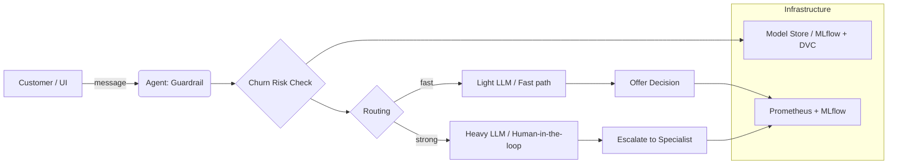

# churn-model — a complete, end-to-end MLOps + LLMOps reference project

A customer churn classifier, wrapped in full production MLOps tooling, plus
a Retention Agent that uses that same model as a tool. Built to demonstrate
the whole lifecycle, not just one piece of it. Everything below is real,
tested code.

## The two systems

**1. Churn prediction (classic MLOps)** — `src/churn_model/`
Trained, versioned (DVC), tracked (MLflow), tested, containerized, served
two ways (BentoML + KServe), monitored (Evidently + Prometheus), with
features managed through Feast. **The champion model genuinely beats a
trivial baseline: 89.7% accuracy vs. 82.1% majority-class baseline** —
promoted automatically by a CI gate that rejects anything that doesn't.

**2. Retention Agent (LLMOps)** — `retention_agent.py`, `agent_tools.py`, `routing.py`
An agent that calls the churn model as a tool, decides whether to offer a
discount or escalate to a human, with a **hard-coded 25% discount ceiling
enforced in code** (survived a real test requesting a 1000% discount), a
prompt-injection guardrail, cost-aware model routing (Haiku vs. Sonnet,
~37% cost savings from routing alone), and full MLflow tracing. Uses a real
Claude API call when `ANTHROPIC_API_KEY` is set; falls back to rule-based
logic otherwise so the whole graph still runs for testing without a key.

## Quickstart

```bash
uv sync
uv run pytest -v                                              # 8 tests, all real
PYTHONPATH=src uv run python -m churn_model.cli --config configs/train_config.yaml
PYTHONPATH=src uv run python -m churn_model.promote --config configs/train_config.yaml
export ANTHROPIC_API_KEY="your-key"   # optional — falls back gracefully without it
uv run python retention_agent.py
uv run python drift_check.py
uv run python rag_pipeline.py
```

Docker (`docker compose up`), the Kubernetes manifests in `k8s/`, and the
GitHub Actions workflow in `.github/workflows/` need Docker / a real
cluster / a real GitHub remote to execute — write correctly, ready to run
where those exist.

## What's real vs. what needs your own credentials

| Works out of the box | Needs something from you |
|---|---|
| Training, testing, DVC, MLflow, the promotion gate | A real LLM key for `decide_action` (falls back gracefully without one) |
| The full agent graph, guardrails, routing, cost math | Docker, to build/run the containers |
| Drift detection, RAG retrieval, Feast | A Kubernetes cluster, for the K8s/KServe manifests |

## Honest development log

Two real bugs were found and fixed while building this, and left visible
rather than polished away: a test that assumed the wrong risk tier for a
customer (fixed by making a real judgment call about routing logic, not
just the test), and a genuine `KeyError` crash on an unknown customer ID
(fixed with explicit graceful degradation to human handoff). Both are now
permanent regression tests in `test_agent_eval.py`.

## Architecture

**High-level architecture**



Notes:
- **Agent** (`retention_agent.py`) runs a deterministic graph: guardrail → risk check → routing → action.
- **Model Store**: models are versioned (DVC) and tracked in MLflow; serving uses the same artifact.
- **Serving**: FastAPI (`src/churn_model/serve.py`) and BentoML (`bento_service.py`) expose the same model.
- **Observability**: routing decisions and costs are exposed to Prometheus; traces are exported to MLflow.
- **Resilience**: the agent falls back to deterministic logic when the LLM key is absent and to an in-repo fallback model when `model.pkl` is not available locally (useful for CI).

